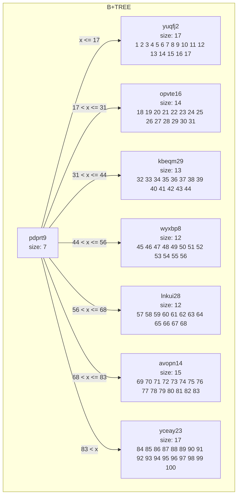

```mermaid
graph TD
subgraph B+TREE
pdprt9[pdprt9<br/>size: 7<br/>]
yuqfj2[yuqfj2<br/>size: 17<br/>1 2 3 4 5 6 7 8 9 10 11 12 13 14 15 16 17 ]
pdprt9-->|x <= 17|yuqfj2
opvte16[opvte16<br/>size: 14<br/>18 19 20 21 22 23 24 25 26 27 28 29 30 31 ]
pdprt9-->|17 < x <= 31|opvte16
kbeqm29[kbeqm29<br/>size: 13<br/>32 33 34 35 36 37 38 39 40 41 42 43 44 ]
pdprt9-->|31 < x <= 44|kbeqm29
wyxbp8[wyxbp8<br/>size: 12<br/>45 46 47 48 49 50 51 52 53 54 55 56 ]
pdprt9-->|44 < x <= 56|wyxbp8
lnkui28[lnkui28<br/>size: 12<br/>57 58 59 60 61 62 63 64 65 66 67 68 ]
pdprt9-->|56 < x <= 68|lnkui28
avopn14[avopn14<br/>size: 15<br/>69 70 71 72 73 74 75 76 77 78 79 80 81 82 83 ]
pdprt9-->|68 < x <= 83|avopn14
yceay23[yceay23<br/>size: 17<br/>84 85 86 87 88 89 90 91 92 93 94 95 96 97 98 99 100 ]
pdprt9-->|83 < x|yceay23
end
```

```mermaid
graph LR
subgraph UNORDERED_HEAP
lrfkq1[lrfkq1<br/>size: 4<br/>96 38 57 16 ]
kvikr3[kvikr3<br/>size: 4<br/>51 78 62 67 ]
lrfkq1-->kvikr3
ruapn4[ruapn4<br/>size: 4<br/>9 44 91 8 ]
kvikr3-->ruapn4
pgyfi5[pgyfi5<br/>size: 4<br/>26 75 2 27 ]
ruapn4-->pgyfi5
jllvi6[jllvi6<br/>size: 4<br/>39 88 14 65 ]
pgyfi5-->jllvi6
yiefb7[yiefb7<br/>size: 4<br/>58 85 7 17 ]
jllvi6-->yiefb7
rgfih10[rgfih10<br/>size: 4<br/>18 68 36 43 ]
yiefb7-->rgfih10
rdlyf11[rdlyf11<br/>size: 4<br/>56 10 60 82 ]
rgfih10-->rdlyf11
fxytq12[fxytq12<br/>size: 4<br/>3 69 59 30 ]
rdlyf11-->fxytq12
ddeva13[ddeva13<br/>size: 4<br/>77 74 100 97 ]
fxytq12-->ddeva13
bsirm15[bsirm15<br/>size: 4<br/>34 12 35 5 ]
ddeva13-->bsirm15
rbumy17[rbumy17<br/>size: 4<br/>87 47 40 53 ]
bsirm15-->rbumy17
lrice18[lrice18<br/>size: 4<br/>98 83 11 42 ]
rbumy17-->lrice18
vllch19[vllch19<br/>size: 4<br/>54 29 50 6 ]
lrice18-->vllch19
gslbj20[gslbj20<br/>size: 4<br/>81 13 72 15 ]
vllch19-->gslbj20
wvchr21[wvchr21<br/>size: 4<br/>92 89 25 94 ]
gslbj20-->wvchr21
jyqfm22[jyqfm22<br/>size: 4<br/>46 80 63 32 ]
wvchr21-->jyqfm22
vyegn24[vyegn24<br/>size: 4<br/>20 61 23 70 ]
jyqfm22-->vyegn24
bwapi25[bwapi25<br/>size: 4<br/>95 64 52 33 ]
vyegn24-->bwapi25
galqu26[galqu26<br/>size: 4<br/>45 76 99 79 ]
bwapi25-->galqu26
gkten27[gkten27<br/>size: 4<br/>31 90 48 24 ]
galqu26-->gkten27
hvpkb30[hvpkb30<br/>size: 4<br/>84 49 55 22 ]
gkten27-->hvpkb30
veqqy31[veqqy31<br/>size: 4<br/>71 37 21 28 ]
hvpkb30-->veqqy31
wmiao32[wmiao32<br/>size: 4<br/>1 4 73 41 ]
veqqy31-->wmiao32
djllf33[djllf33<br/>size: 4<br/>86 19 66 93 ]
wmiao32-->djllf33
end
```
